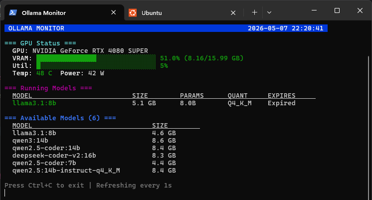
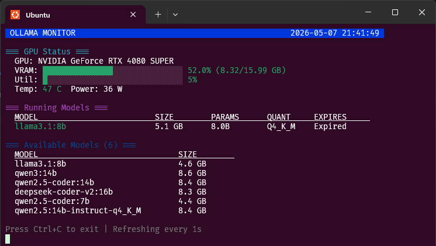

# Ollama Monitor

[](https://github.com/palmaguer/ollama-monitor/releases)
[](LICENSE)
[](https://github.com/palmaguer/ollama-monitor/releases)
[](https://github.com/palmaguer/ollama-monitor/actions)

Real-time `top`-style TUI for [Ollama](https://ollama.ai/) LLM servers — monitor GPU metrics (VRAM, 
temperature, power), running models, and available models across **Windows** and **Linux**.

---

## Screenshots

### Windows (PowerShell)


### Linux (WSL2 Ubuntu)


---

## What's New in v1.1.1
- **UTF-8 Progress Bars** - Replaced `|` pipe characters with Unicode block chars (`█`/`░`) for cleaner output.

## What's New in v1.1.0

- **Linux/WSL2 Support** — Full cross-platform support. Now runs natively on **Ubuntu**, **Debian**, and 
**WSL2** environments.
- **GPU Monitoring on Linux** — NVML support via `libnvidia-ml.so` with the same rich metrics as 
**Windows**.
- **GitHub Actions CI/CD** — Automated builds for both **Linux** and **Windows** on every tagged release.


## Features

- **GPU Monitoring** — Real-time **VRAM usage**, **GPU utilization**, **temperature**, and **power 
consumption** (full metrics for **NVIDIA**; basic support for **AMD/Intel** via **DXGI**).
- **Ollama Integration** — View **running models**, **loaded context**, and **available models** from your 
local Ollama server.
- **Multi-GPU** — Supports **any number of GPUs**, displayed in a unified view.
- **Lightweight** — No heavy dependencies; uses **native platform APIs** (NVML, DXGI, WinHTTP, libcurl).
- **Top-style UI** — Clean, **color-coded console interface** with **configurable auto-refresh**.

---

## Quick Start

### Pre-built Binaries

Download the latest binary for your platform from the 
[Releases](https://github.com/palmaguer/ollama-monitor/releases) page:

| Platform         | Binary                      |
|------------------|-----------------------------|
| Linux x64        | `ollama-monitor`            |
| Windows x64      | `ollama-monitor.exe`        |

```bash
# Run with default settings (1 second refresh)
./ollama-monitor

# Custom refresh rate (2 seconds)
./ollama-monitor -r 2

# Connect to Ollama on a different host/port
./ollama-monitor -u http://192.168.1.100:11434

# Run once and exit (useful for scripts)
./ollama-monitor --once --no-clear
```

## Installation

### For Unix-like Systems

You have several options for installing the binary:

1. **User-specific installation** (`~/.local/bin`):
   ```bash
   mkdir -p ~/.local/bin
   cp ollama-monitor ~/.local/bin/
   export PATH=~/.local/bin:$PATH
   ```

2. **System-wide installation** (recommended path: `/usr/local/bin`):
   ```bash
   sudo cp ollama-monitor /usr/local/bin/
   ```

3. **Custom path**:
   Keep the binary in any directory and add it to your `PATH`:
   ```bash
   export PATH=/path/to/ollama-monitor:$PATH
   ```

4. **Windows installation** (similar to Unix-like systems):
   - Place the binary in a directory like `C:\Users\<YourName>\AppData\Local\bin` and add it to your 
system `PATH`.
   - Or use the `.\ollama-monitor.exe` directly from the current directory.

---

## Building from Source

### Prerequisites

| Platform         | Requirements                                                                 |
|------------------|------------------------------------------------------------------------------|
| **Windows**      | **Windows 10/11**, **NVIDIA** (full) / **AMD, Intel** (basic), **Ollama** installed 
and running, **Visual Studio 2022 + CMake 3.20+** |
| **Linux / WSL2** | **Ubuntu 20.04+ / WSL2**, **NVIDIA with drivers** (`nvidia-smi`), **Ollama** 
installed and running, **build-essential**, **cmake**, **libcurl4-openssl-dev** |

### Build Steps

**Windows:**

See the dedicated PowerShell guide:

 - [Windows Compilation using Powershell](./docs/howto/windows-compilation-powershell.md)

**Linux / WSL2:**

See the dedicated Linux guide:

 - [Linux / WSL2 Compilation](./docs/howto/linux-compilation.md)

---

## Usage

### Command Line Options

| Option             | Description                                                                 |
|--------------------|-----------------------------------------------------------------------------|
| `-h, --help`       | Show help message                                                           |
| `-r, --refresh <sec>` | Set refresh rate in seconds (default: 1)                                   |
| `-u, --url <url>`  | Ollama server URL (default: `http://localhost:11434`)                       |
| `-1, --once`       | Run once and exit                                                           |
| `-n, --count <num>` | Run **N times** then exit                                                   |
| `--no-clear`       | Don't clear screen between updates                                          |

### Keyboard Controls

| Key         | Action      |
|-------------|-------------|
| `Ctrl+C`    | Exit        |

### Example Output

```
 OLLAMA MONITOR                                              2026-05-07 22:35:50

=== GPU Status ===
  GPU: NVIDIA GeForce RTX 4080 SUPER
  VRAM: ████████████████████████░░░░░░ 82.6% (13.21/15.99 GB)
  Util: █░░░░░░░░░░░░░░░░░░░░░░░░░░░░░ 4%
  Temp: 42 C  Power: 31 W

=== Running Models ===
  MODEL                         SIZE        PARAMS      QUANT     EXPIRES
  qwen2.5-coder:14b             17.2 GB     14.8B       Q4_K_M    Expired

=== Available Models (6) ===
  MODEL                              SIZE
  llama3.1:8b                        4.6 GB
  qwen3:14b                          8.6 GB
  qwen2.5-coder:14b                  8.4 GB
  deepseek-coder-v2:16b              8.3 GB
  qwen2.5-coder:7b                   4.4 GB
  qwen2.5:14b-instruct-q4_K_M        8.4 GB

Press Ctrl+C to exit | Refreshing every 1s
```

---

## How It Works

### GPU Monitoring

The application detects and displays all available GPUs automatically.

#### **NVIDIA (Full Support)**

Dynamically loads **NVML** from the NVIDIA driver at runtime — **no CUDA toolkit required**. Provides:

- GPU name and model
- VRAM total, used, free
- GPU utilization percentage
- Temperature
- Power consumption

#### **AMD / Intel (Basic Support)**

Falls back to **DXGI**, which provides:

- GPU name and model
- Total VRAM

**Limitations of DXGI fallback:** Current **VRAM usage**, **GPU utilization**, **temperature**, and 
**power consumption** are not available. Full **AMD support** would require the **ADL SDK**; **Intel** 
would need **IGCL or Level Zero API**. Contributions welcome!

### Ollama Integration

Uses **Ollama's REST API** — `/api/tags` for available models and `/api/ps` for running models. HTTP 
requests use **native platform APIs**:

- **Windows**: **WinHTTP**
- **Linux / WSL2**: **libcurl**

---

## Changelog

See [CHANGELOG.md](CHANGELOG.md) for the full release history.

---

## Roadmap

See [ROADMAP.md](ROADMAP.md) for planned features (system stats, config files, Prometheus export, 
interactive TUI, and more).

---

## Contributing

This project is a fork of [yonie/ollama-monitor](https://github.com/yonie/ollama-monitor), with continued 
development and support during my free time. As a newcomer to the open-source AI world, I began using 
**Ollama** to run tests on my local machines and discovered the original project. Since I spend more time 
working in **Linux and macOS development environments**, I decided to fork the original project and add 
support for these platforms.

Contributions are welcome and must comply with the [MIT License](LICENSE). See 
[CONTRIBUTING.md](CONTRIBUTING.md) for more information.

---

## License

[MIT License](LICENSE) — see [LICENSE](LICENSE).

---

## Related Projects

- [ollama-monitor](https://github.com/yonie/ollama-monitor) — Original Project by [Yonie](https://github.com/yonie) 
- [nvtop](https://github.com/Syllo/nvtop) — Linux GPU monitoring
- [btop](https://github.com/aristocratos/btop) — Linux system monitor


## Support

If you find this tool helpful, consider buying a coffee for the [original creator](https://github.com/yonie).

[](https://buymeacoffee.com/yonie)
[](https://buymeacoffee.com/palmaguer)
